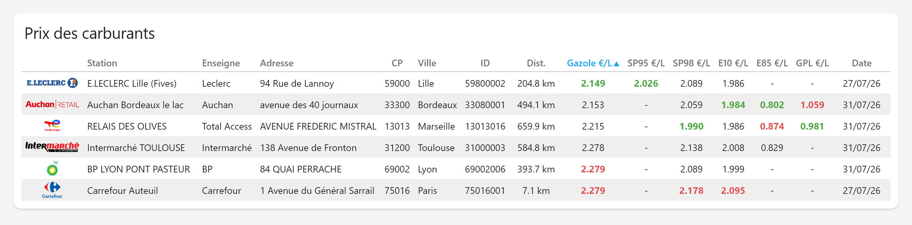
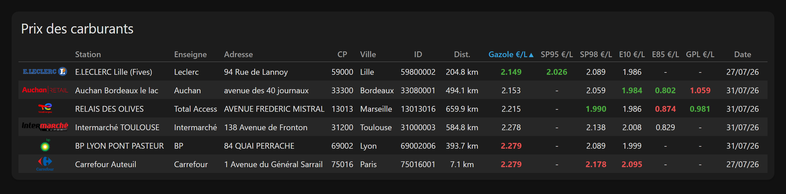

# Prix Carburant Card

Tableau des prix des carburants pour Home Assistant, à partir de l'intégration
[Prix Carburant](https://github.com/Aohzan/hass-prixcarburant) : une ligne par station,
une colonne par carburant.



- Lit les entités par leurs **attributs** (`station_id` + `fuel_type`), pas par leur
  `entity_id` : renommer une entité ne casse rien, et aucun sensor template n'est nécessaire.
- **Choix et ordre** des stations et des colonnes, en YAML comme à la souris.
- **Tri** configurable et **clic sur les en-têtes** pour trier à la volée.
- **Noms et villes surchargeables**, **logos** par enseigne ou par station.
- Prix le plus bas en vert, le plus haut en rouge, **ex æquo compris**.
- Éditeur graphique en six sections repliables, alimenté par ce que l'intégration
  remonte réellement.
- Sélecteur de carte **« par entité »** de HA 2026.6+ : cliquer sur un sensor de
  l'intégration propose deux mises en page prêtes à l'emploi.
- **Français et anglais**, carte et éditeur, suivant la langue de Home Assistant.

Version de la carte : **1.0.2** · Home Assistant **2024.4+** (le sélecteur par entité
demande 2026.6+, il est simplement ignoré avant).

## Installation

**Prérequis** — l'intégration [Prix Carburant](https://github.com/Aohzan/hass-prixcarburant)
d'Aohzan, qui fournit les données. Elle interroge le flux public
[prix des carburants en France](https://data.economie.gouv.fr/explore/dataset/prix-des-carburants-en-france-flux-instantane-v2/)
et crée un sensor par couple (station, carburant). La carte ne fait que lire ces entités :
sans l'intégration, elle n'a rien à afficher.

**HACS** — dépôt personnalisé, catégorie *Lovelace*. HACS installe l'archive de la
release, qui contient la carte **et** son dossier `lang/`.

**Manuellement** — télécharger `carte-burant.zip` depuis la
[dernière release](https://github.com/Pulpyyyy/carte-burant/releases/latest) et l'extraire
dans `config/www/community/carte-burant/`. Le dossier doit contenir :

```
config/www/community/carte-burant/
├── carte-burant.js
└── lang/
    ├── fr.js
    └── en.js
```

Puis *Paramètres → Tableaux de bord → Ressources* :

```yaml
url: /hacsfiles/carte-burant/carte-burant.js
type: module
```

Le `type: module` n'est pas décoratif : la carte importe ses fichiers de langue par chemin
relatif. Sans le dossier `lang/` à côté d'elle, elle ne se charge pas du tout.

## Le minimum qui marche

Aucune option n'est obligatoire : sans configuration, la carte affiche toutes les stations
connues, triées par distance, avec les colonnes par défaut.

```yaml
type: custom:prix-carburant-card
```

## Configuration complète, commentée

```yaml
type: custom:prix-carburant-card

# ---- En-tête ---------------------------------------------------------------
title: Prix carburants        # omis ou vide : pas d'en-tête du tout
show_title: true              # false : garde le texte en config, masque l'en-tête

# ---- Quelles stations ------------------------------------------------------
# Liste vide ou absente = toutes les stations remontées par l'intégration,
# y compris celles qu'elle ajoutera plus tard. Dès qu'une liste est écrite,
# elle est figée : une nouvelle station n'apparaîtra pas toute seule.
# L'ordre compte uniquement avec `sort: manual`.
stations:
  - "45650001"
  - "45160001"
  - "45140002"

# ---- Quel ordre ------------------------------------------------------------
sort: E10                     # distance | name | brand | address | city | postal_code
                              # | station_id | updated | manual
                              # | un fuel_type (tri par prix)
sort_desc: false              # true : ordre décroissant
sortable: true                # false : en-têtes non cliquables

# ---- Quelles colonnes, dans quel ordre -------------------------------------
# Forme courte (un identifiant) ou forme longue (voir « Colonnes » plus bas).
columns:
  - logo
  - name
  - city
  - distance
  - Gazole
  - E10
  - SP95
  - SP98
  - GPLc
  - updated

# ---- Format des prix -------------------------------------------------------
decimals: 3                   # nombre de décimales, entier de 0 à 10
unit: €/L                     # suffixe des en-têtes de carburant ; "" pour aucun
highlight: true               # coloration du prix mini / maxi
color_min: "#4caa40"
color_max: "#e05252"

# ---- Interaction et fond ---------------------------------------------------
more_info: true               # clic sur une ligne = fiche de la 1re entité de la station
background: rgba(25,25,25,0.6)   # fond de la ha-card ; omis = fond du thème

# ---- Surcharges de libellés ------------------------------------------------
# Clef = station_id. Une valeur vide ou absente laisse la valeur de l'intégration.
station_names:
  "45650001": Leclerc Saran
  "45160001": Intermarché Olivet
station_cities:
  "45650001": Saran Nord

# ---- Logos -----------------------------------------------------------------
# Clef = enseigne normalisée (minuscules, sans accent ni ponctuation)
# ou station_id, qui l'emporte sur l'enseigne.
logo_path: /local/images/brands/   # préfixe des valeurs *relatives* uniquement
logos:
  leclerc: leclerc.png
  intermarche: intermarche.png
  totalenergies: total.svg
  "45650001": https://exemple.tld/logo-special.png
```

## Options

| Option | Type | Défaut | Description |
|---|---|---|---|
| `title` | string | — | En-tête de la carte. Omis ou vide : pas d'en-tête. |
| `show_title` | bool | `true` | `false` masque l'en-tête sans effacer `title`. |
| `stations` | liste | `[]` | `station_id` à afficher, dans l'ordre de `sort: manual`. **Vide = toutes**, y compris les futures. |
| `station_names` | map | `{}` | `station_id: nom` — surcharge le nom. |
| `station_cities` | map | `{}` | `station_id: ville` — surcharge la ville. |
| `columns` | liste | `[logo, name, distance, E10, SP95, SP98, updated]` | Colonnes et leur ordre. Liste vide = la valeur par défaut. |
| `sort` | string | `distance` | Colonne de tri au chargement (voir *Tri*). |
| `sort_desc` | bool | `false` | Inverse le sens du tri. |
| `sortable` | bool | `true` | En-têtes cliquables pour trier à la volée. |
| `decimals` | number | `3` | Décimales des prix, entier de 0 à 10. Hors bornes : carte d'erreur. |
| `unit` | string | `€/L` | Suffixe ajouté aux en-têtes de carburant. `""` pour aucun. |
| `highlight` | bool | `true` | Coloration mini / maxi. |
| `color_min` | string | `#4caa40` | Couleur du prix le plus bas. |
| `color_max` | string | `#e05252` | Couleur du prix le plus haut. |
| `more_info` | bool | `true` | Clic sur une ligne → fiche de l'entité. |
| `logos` | map | `{}` | `enseigne: fichier` ou `station_id: fichier`. |
| `logo_path` | string | `""` | Préfixe ajouté devant les valeurs **relatives** de `logos`. |
| `background` | string | — | Fond de la `ha-card`, n'importe quelle valeur CSS. |

Les clefs de `station_names`, `station_cities` et `logos` sont converties en chaînes :
`45650001` sans guillemets et `"45650001"` désignent la même station. Une configuration
invalide (`columns` qui n'est pas une liste, `logos` qui n'est pas une table…) affiche une
carte d'erreur explicite plutôt que d'échouer silencieusement.

## Colonnes

Identifiants acceptés, en plus des carburants :

| Clef | En-tête | Contenu |
|---|---|---|
| `logo` | *(vide)* | Logo de l'enseigne, sinon son nom en texte, sinon `—`. |
| `name` | Station | Nom, surchargeable par `station_names`. |
| `brand` | Enseigne | Attribut `brand`. |
| `address` | Adresse | Attribut `address`. |
| `city` | Ville | Ville, surchargeable par `station_cities`. |
| `postal_code` | CP | Attribut `postal_code`. |
| `station_id` | ID | Identifiant de la station. |
| `distance` | Dist. | Distance en km, une décimale. |
| `updated` | Date | Relevé le plus récent de la station, `jj/mm/aa`. |

**Tout autre identifiant est traité comme un `fuel_type`** : `Gazole`, `E10`, `E85`,
`SP95`, `SP98`, `GPLc` — et tout carburant que l'intégration viendrait à remonter. Une
station qui ne vend pas ce carburant affiche `-`. L'en-tête reprend l'identifiant suivi de
`unit`, à une exception près : `GPLc` s'affiche **GPL**.

Forme longue, pour renommer, aligner, dimensionner ou figer une colonne :

```yaml
columns:
  - logo                       # forme courte
  - key: name                  # forme longue
    name: Enseigne et station  # remplace l'en-tête (et supprime le suffixe `unit`)
    width: 40%                 # n'importe quelle largeur CSS
  - key: E10
    name: Sans plomb 95-E10
    align: right               # left | center | right
  - key: updated
    sortable: false            # cette colonne ne réagit pas au clic
```

Valeurs par défaut : `align` vaut `left` pour `name`, `brand`, `address`, `city`,
`center` partout ailleurs ; `width` n'est fixée que pour `logo` (40 px), `name` (34 %),
`distance` (9 %) et `updated` (11 %). `fuel` et `type` sont acceptés comme synonymes de
`key`.

## Tri

`sort` fixe le tri au chargement :

- `distance`, `name`, `brand`, `city`, `postal_code`, `address`, `station_id`, `updated` ;
- n'importe quel `fuel_type` : tri par prix ;
- `manual` : l'ordre est celui de la liste `stations`, tel qu'écrit dans la configuration.

Les valeurs manquantes (carburant absent, distance inconnue) sont **toujours** renvoyées
en fin de tableau, quel que soit le sens du tri. À égalité, le nom de la station départage.

Avec `sortable: true`, un clic sur un en-tête trie sur cette colonne, un second clic
inverse le sens (▲ / ▼ apparaît sur la colonne active). Ce tri est **temporaire** : il
n'est pas écrit dans la configuration et repart de `sort` au rechargement de la page.
La colonne `logo` n'est jamais cliquable.

### Revenir au tri configuré

Le tri de la configuration n'a pas toujours d'en-tête à cliquer : `manual` n'en a aucun
par construction, et rien n'oblige à afficher la colonne sur laquelle `sort` porte. Deux
chemins de retour, qui font exactement la même chose :

**Le bouton ↺**, au-dessus du tableau. Il n'apparaît **que** lorsqu'un tri au clic est
actif, et affiche la destination : `↺ ≡ Ordre personnalisé`, `↺ Distance ▲`… C'est le
chemin fiable, il ne dépend d'aucune colonne affichée.

**Le troisième clic** sur l'en-tête courant, sur n'importe quelle colonne :

| Clic | Résultat |
|---|---|
| 1 | Croissant sur cette colonne |
| 2 | Décroissant |
| 3 | Retour au tri configuré, `sort_desc` compris |

Quand le tri configuré est déjà l'état descendant de la colonne cliquée, il n'y a rien à
distinguer et le cycle reste à deux états. Le marqueur ≡ apparaît sur la colonne `name`
quand le tableau suit ton ordre personnalisé et que cette colonne est affichée.

## Coloration des prix

Le prix le plus bas passe en vert, le plus haut en rouge — mais seulement s'il existe une
vraie dispersion, sinon toute la colonne serait colorée :

| Valeurs distinctes dans la colonne | Vert | Rouge |
|---|---|---|
| 1 | oui | non |
| 2 et plus | oui | oui |

Le plancher est **toujours** signalé, même quand la colonne ne contient qu'un seul prix ou
que toutes les stations sont au même tarif : c'est le prix à payer, autant le dire en vert.
Le plafond n'apparaît qu'à partir de deux valeurs distinctes, sans quoi la même cellule
serait à la fois la moins chère et la plus chère.

Les **ex æquo sont tous colorés** : trois stations au même prix plancher sont trois fois
la bonne affaire. `highlight: false` désactive complètement la coloration.

## Noms et villes

```yaml
station_names:
  "45650001": Leclerc Saran
station_cities:
  "45650001": Saran Nord
```

Le référentiel gouvernemental laisse beaucoup de stations sans nom ; l'intégration renvoie
alors `Undefined`. La carte affiche dans ce cas `enseigne + identifiant`, et c'est
typiquement là que `station_names` sert. Les surcharges valent aussi pour le tri et les
infobulles.

## Logos

Ordre de recherche pour chaque ligne :

1. `logos[station_id]` — le plus spécifique ;
2. `logos[enseigne normalisée]` — minuscules, sans accent ni ponctuation
   (`Intermarché Contact` → `intermarchecontact`, `TotalEnergies` → `totalenergies`) ;
3. l'`entity_picture` fourni par l'intégration, si l'option *afficher les images* y est
   activée ;
4. à défaut, le nom de l'enseigne en texte, puis `—`.

`logo_path` n'est ajouté que devant les valeurs **relatives** : une URL complète
(`https://…`), un chemin absolu (`/local/…`) ou un `data:` sont utilisés tels quels, même
avec un préfixe global défini.

## Éditeur graphique

Six sections repliables, dans l'ordre des décisions :

| Section | Contenu |
|---|---|
| **Stations** | Une case par station, ▲ / ▼ pour ordonner. Filtre au-delà de 8 stations ; les flèches sont neutralisées tant qu'un filtre est actif, l'ordre n'ayant pas de sens sur une liste partielle. |
| **Tri** | `sort`, `sort_desc`, `sortable`. « ≡ Ordre personnalisé des stations » est en tête de liste, séparé des tris portant sur une donnée. |
| **Colonnes** | Interrupteur par colonne, ▲ / ▼ pour ordonner. |
| **Affichage** | `title`, `show_title`, `unit`, `decimals` (0 à 3 dans l'éditeur, jusqu'à 10 en YAML), `highlight`, `more_info`. |
| **Noms et villes** | Un champ nom et un champ ville par station affichée, plus les surcharges devenues orphelines. |
| **Logos des enseignes** | Préfixe, puis un champ et un aperçu par enseigne détectée. |

`background`, `color_min` et `color_max` ne sont pas exposés par l'éditeur : ils se règlent
en YAML et l'éditeur les conserve intacts.

Seule *Stations* est ouverte au départ ; chaque section repliée affiche son état
(« 5 sur 12 », « Distance ↑ », « 3 surcharges »…), inutile de l'ouvrir pour savoir ce
qu'elle contient. Dans les listes à interrupteurs, les éléments affichés sont regroupés en
tête, un séparateur *Masquées* marque la frontière.

Deux verrous, avec leur explication en infobulle : la dernière colonne et la dernière
station cochées ne peuvent pas être décochées — une liste vide signifiant « toutes » ou
« celles par défaut », l'éditeur ferait exactement l'inverse de ce qui est demandé.

**Liste figée à la première modification.** Tant que la section *Stations* n'est pas
touchée, `stations` reste absent de la configuration et la carte suit toutes les stations
de l'intégration, futures comprises — toutes les cases sont donc cochées. Dès que tu en
décoches une, que tu en réordonnes une, ou que tu choisis « ≡ Ordre personnalisé », la
liste complète est écrite en configuration et cesse de suivre les ajouts de l'intégration.
Pour revenir au suivi automatique, il faut retirer `stations` à la main en YAML.

## Sélecteur de carte « par entité » (HA 2026.6+)

Dans l'onglet *Par entité* du sélecteur de cartes, choisir un sensor de l'intégration fait
apparaître deux propositions, section *Communauté* :

- **Comparer les stations — *carburant*** : toutes les stations, la colonne du carburant
  cliqué, triée par prix ;
- **Cette station, tous carburants** : la station seule, tous ses carburants.

## Langue

La carte et l'éditeur sont traduits en **français** et en **anglais**. La langue suit celle
du frontend (`hass.locale.language`) : français dès qu'elle commence par `fr` — `fr`,
`fr-CA`, `fr-BE` —, anglais dans tous les autres cas. Il n'y a aucune option à régler, et
changer de langue dans Home Assistant met la carte à jour sans recharger la page.

Un fichier par langue dans [`dist/lang/`](dist/lang/), importé statiquement par la carte.
**Ajouter une langue** tient en trois gestes : copier `lang/fr.js` en `lang/xx.js` et
traduire les valeurs — les clefs sont communes et rangées dans le même ordre —, l'importer
en tête de `carte-burant.js`, et l'ajouter à `STRINGS` puis à `setLanguageFrom`. Les
contributions sont les bienvenues.

Ce qui **n'est pas** traduit, volontairement :

- les identifiants de configuration (`sort`, `columns`, `stations`…), qui sont des clefs
  YAML et non du texte affiché ;
- les identifiants de carburant du référentiel gouvernemental. `Gazole`, `E10`, `GPLc`
  s'écrivent ainsi dans `columns` et dans `sort` quelle que soit la langue — seule leur
  **étiquette d'affichage** change : `Gazole` devient *Diesel* et `GPLc` devient *LPG* en
  anglais, `GPL` en français ;
- les données remontées par l'intégration (noms de stations, villes, adresses).

Le nom et la description affichés dans le sélecteur de cartes sont lus une seule fois au
chargement du fichier : eux seuls demandent un rechargement de la page après un changement
de langue.

## Variables CSS

À définir sur la carte (via `card_mod` ou un thème) :

| Variable | Défaut | Effet |
|---|---|---|
| `--prix-carburant-font-size` | `14px` | Taille du texte du tableau. |
| `--prix-carburant-logo-size` | `24px` | Hauteur des logos. |
| `--prix-carburant-stripe` | `rgba(127,127,127,0.12)` | Fond des lignes paires. |
| `--prix-carburant-hover` | `rgba(127,127,127,0.22)` | Fond de la ligne survolée. |
| `--prix-carburant-color-min` | `color_min` | Couleur du prix le plus bas. |
| `--prix-carburant-color-max` | `color_max` | Couleur du prix le plus haut. |

Sous 600 px de large, la carte réduit d'elle-même le texte, les marges et les logos.
En vue *sections*, elle demande la pleine largeur (minimum 6 colonnes sur 12).

La carte suit le thème de Home Assistant :



*Les deux captures montrent **toutes** les colonnes reconnues par la carte, sur des relevés
réels du flux public
[prix des carburants en France](https://data.economie.gouv.fr/explore/dataset/prix-des-carburants-en-france-flux-instantane-v2/)
— six enseignes, six villes, distances calculées depuis Paris. Elles sont produites par
[`tools/screenshot.html`](tools/screenshot.html), qui charge la vraie carte depuis `dist/`
et lui passe un `hass` réduit ; `pwsh tools/screenshot.ps1` les régénère.*

## Dépannage

**« Aucune station : vérifie l'intégration Prix Carburant. »** — aucun sensor ne porte à la
fois les attributs `station_id` et `fuel_type`. Vérifier que l'intégration est chargée et
que ses entités ne sont pas désactivées.

**« Aucune des stations demandées n'est remontée par l'intégration. »** — les identifiants
de `stations` ne correspondent à rien de connu. Comparer avec l'attribut `station_id` d'un
sensor dans *Outils de développement → États*.

**Une colonne entière affiche `-`** — l'identifiant n'est pas un `fuel_type` remonté par
l'intégration (attention à la casse : `GPLc`, pas `gplc`), ou aucune des stations affichées
ne vend ce carburant.

**Un logo ne s'affiche pas** — dans l'éditeur, le cadre d'aperçu passe en rouge et
l'infobulle donne l'URL réellement demandée : c'est en général `logo_path` qui manque ou
qui est en trop.
